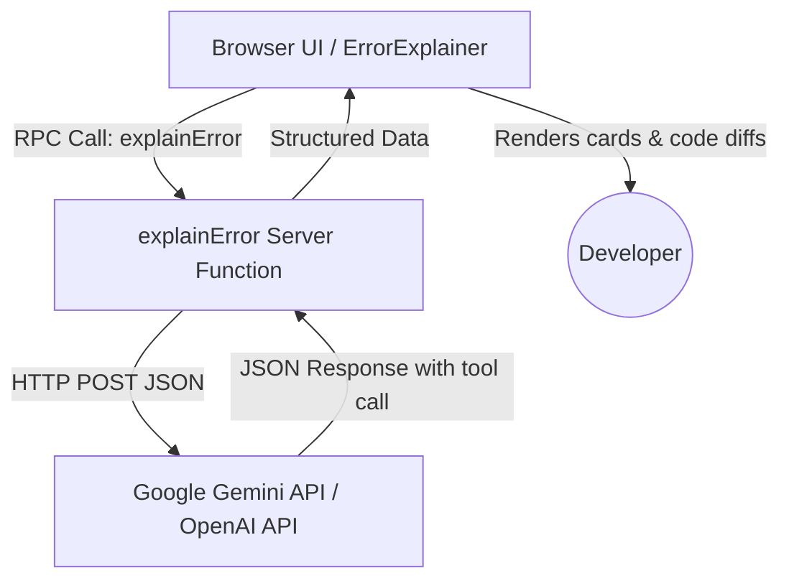
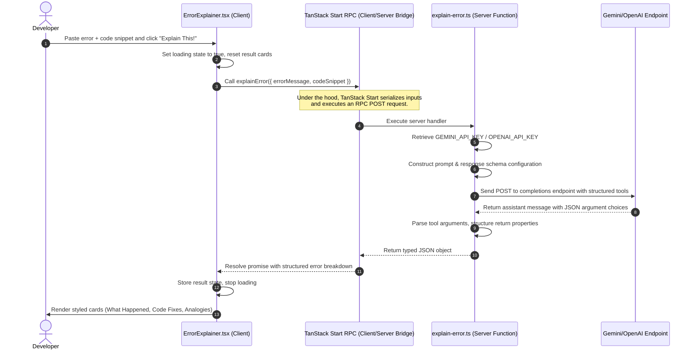

# 🐛 Bug Whisperer

> **Code Error Explainer for Beginners** — Paste any error message, get a simple, jargon-free explanation, analogies, and code fixes. No panic, just clarity!

---

## 🌟 Overview

**Bug Whisperer** is a full-stack web application designed for beginner developers (0-6 months of experience) to help demystify intimidating error messages. Instead of copy-pasting cryptic logs into search engines or getting overwhelmed by dense stack overflow threads, developers can paste their error messages and optional code snippets to get:

1. **What Happened**: A plain-English explanation of the error message.
2. **Why It Happened**: The core concept behind the error, explained with everyday analogies (e.g. comparing brackets to open/close doors).
3. **Where to Look**: Specific guidance on where the issue is likely located in the file or code.
4. **How to Fix It**: Clear, sequential steps to resolve the bug.
5. **Code Fixes**: Side-by-side diff comparison (`❌ Before` and `✅ After`) showing broken vs. corrected code.
6. **Encouragement**: A friendly boost of confidence to keep the user motivated.

---

## 🛠️ Tech Stack

The project is built using a clean, modern, and high-performance stack:

*   **Frontend & Layout**: [React 19](https://react.dev/) & [Tailwind CSS v4](https://tailwindcss.com/) for fluid responsive styling, custom themes, and glassmorphism layouts.
*   **Routing & Full-Stack RPC**: [TanStack Start](https://tanstack.com/router/v1/docs/start/overview) (the unified React Router & SSR framework) to handle file-based routing and seamless client-to-server function calls (RPCs).
*   **Type Safety & Validation**: [TypeScript](https://www.typescriptlang.org/) and [Zod](https://zod.dev/) for robust server-side request parsing.
*   **AI Models**: Powering completions using Google [Gemini 2.5 Flash](https://deepmind.google/technologies/gemini/) (or OpenAI [GPT-4o mini](https://openai.com/)), configured automatically via native API endpoints.

---

## 📁 Code Structure

The workspace follows a clean, modular folder layout:

```text
c:/Users/lokes/Downloads/error-buddy-main/
├── src/
│   ├── components/
│   │   ├── ui/
│   │   │   ├── button.tsx       # Reusable button component
│   │   │   └── textarea.tsx     # Reusable textarea component
│   │   └── ErrorExplainer.tsx   # Core application interface & controller
│   ├── functions/
│   │   └── explain-error.ts     # Server function calling the Gemini/OpenAI API
│   ├── routes/
│   │   ├── __root.tsx           # Base layout (meta tags, styling, shells)
│   │   └── index.tsx            # Home page route wrapper
│   ├── lib/
│   │   └── utils.ts             # Tailwind class merging utility
│   ├── router.tsx               # TanStack Router configuration & error boundaries
│   ├── routeTree.gen.ts         # Generated route tree
│   └── styles.css               # Tailwind CSS v4 source stylesheet
├── components.json              # Shadcn CLI config
├── eslint.config.js             # Linting rules
├── package.json                 # Dependency manifest
├── tsconfig.json                # TypeScript settings
├── vite.config.ts               # Vite bundler configuration (TanStack Start + Tailwind plugins)
└── wrangler.jsonc               # Cloudflare configuration manifest
```

---

## 🔄 Workflow & Execution Flow

Below is the execution flow from the moment a user submits an error to when the explanation is rendered:

### Application Architecture



### Detailed Sequence Flow



---

## ⚡ Setup & Local Installation

### Prerequisites
*   Node.js (v18 or higher) or [Bun](https://bun.sh/)
*   A Google Gemini API Key (`GEMINI_API_KEY`) or an OpenAI API Key (`OPENAI_API_KEY`).

### 1. Clone or Extract the Project
Ensure you are in the project's root folder:
```bash
cd c:/Users/lokes/Downloads/error-buddy-main
```

### 2. Install Dependencies
Run the installation command depending on your package manager:
```bash
npm install
# or
bun install
```

### 3. Configure Environment Variables
Create a `.env` file in the root of the project (or export them directly in your shell):
```env
# If using Google Gemini (Recommended - default model is gemini-2.5-flash)
GEMINI_API_KEY=your_gemini_api_key_here

# OR if using OpenAI (default model is gpt-4o-mini)
# OPENAI_API_KEY=your_openai_api_key_here
```

---

## 🚀 Running the Project Locally

### Start Development Server
Run the Vite development server:
```bash
npm run dev
# or
bun run dev
```
Open [http://localhost:3000](http://localhost:3000) (or the port specified in terminal output) in your browser.

### Build for Production
To test the production build locally:
```bash
npm run build
# or
bun run build
```
This compiles both the client-side assets and the SSR server build to the `dist/` directory, outputting zero-warning optimized bundles.

---

## 💡 Usage Guide

1.  **Paste Error Message**: Paste any console error, stack trace, or compiler diagnostic in the main input box.
2.  **Add Code Snippet (Optional)**: Click **"+ Add code snippet"** to provide the lines of code that triggered the error. This helps the AI customize the before/after comparisons specifically to your file.
3.  **Click "Explain This!"**: Wait 1-2 seconds for the server function to bridge with the LLM API.
4.  **Review the Cards**:
    *   Look at **What Happened** to understand the high-level issue.
    *   Read the **Why It Happened** analogy to cement your understanding of the concept.
    *   Inspect **Code Fix** to see side-by-side comparison of the bug.
    *   Click **"Copy fixed code"** to copy the correct solution directly to your clipboard.
5.  **Try Examples**: Click any of the preloaded buttons (e.g. `TypeError: Cannot read properties of undefined (reading 'map')`) to instantly see how the application works!
