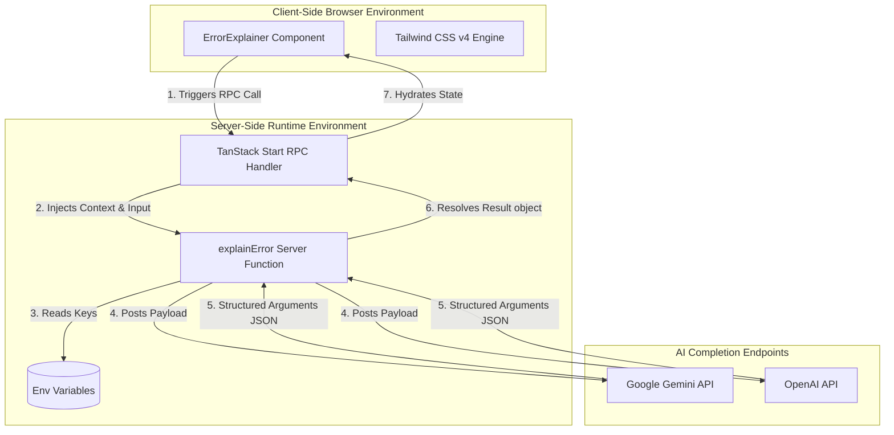
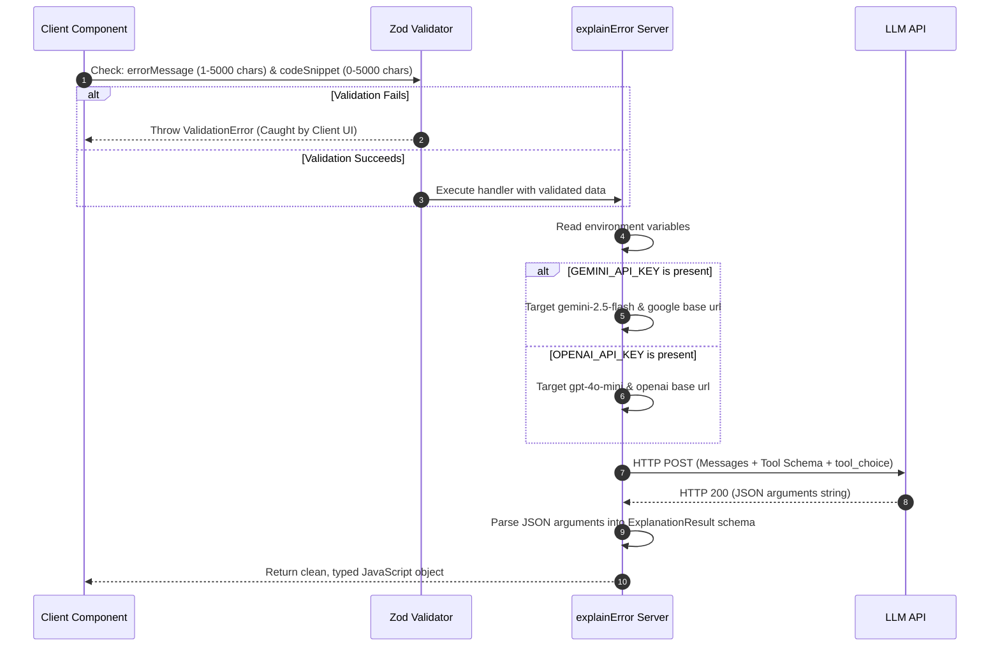

# 🏛️ System Architecture Design — Bug Whisperer

This document details the architectural design, directory relationships, technology choices, and component data flows of the **Bug Whisperer** application.

---

## 🎯 1. Objective & Design Philosophy

The primary objective of **Bug Whisperer** is to lower the barrier to entry for beginner developers by translating technical and often intimidating error traces into warm, educational, and actionable feedback.

### Architectural Core Principles
1.  **Lightweight Frontend**: The browser serves purely as an input receiver and structured renderer. There are no heavy runtime compilation engines or client-side LLM wrappers loaded.
2.  **Server-Side Execution (SSR & RPC)**: Crucial details (like API secrets, request packaging, and parsing logic) are kept strictly on the server layer. Client components execute these server functions through transparent Remote Procedure Calls (RPC).
3.  **Vendor Agnosticism**: Avoid vendor lock-in. The application natively supports both Google Gemini and OpenAI backends. It detects available credentials and configures base URLs, headers, and model parameters dynamically at runtime.
4.  **Zero Build Debt**: Strict dependency hygiene. The application maintains only what is required to compile React, routing, Tailwind CSS v4, and Zod validations.

---

## 🏗️ 2. High-Level System Architecture

The application uses an **SSR (Server-Side Rendering) Unified Model** enabled by **TanStack Start**. This structure bridges frontend and backend code within a single, highly performant directory layout.



---

## ⚙️ 3. Key Modules & Directory Responsibilities

The codebase is organized into modular files with a strict separation of concerns:

### 3.1 Routing & Base Page Shell
*   **[`src/router.tsx`](file:///c:/Users/lokes/Downloads/error-buddy-main/src/router.tsx)**: Initializes the routing engine. Provides standard, user-friendly HTML error boundaries (`DefaultErrorComponent`) which catch runtime render crashes and offer a single-click "Try again" reset button.
*   **[`src/routes/__root.tsx`](file:///c:/Users/lokes/Downloads/error-buddy-main/src/routes/__root.tsx)**: Configures global SEO metadata (og:title, viewport, Twitter cards), inserts the stylesheet reference, and configures the standard root shell component (`RootShell`).
*   **[`src/routes/index.tsx`](file:///c:/Users/lokes/Downloads/error-buddy-main/src/routes/index.tsx)**: Binds the home path (`/`) to the primary UI container.

### 3.2 View & Controller Component
*   **[`src/components/ErrorExplainer.tsx`](file:///c:/Users/lokes/Downloads/error-buddy-main/src/components/ErrorExplainer.tsx)**: Implements the state machine for the application (inputs, loading skeleton, error toasts, and visual result cards). 

### 3.3 Server & RPC Layer
*   **[`src/functions/explain-error.ts`](file:///c:/Users/lokes/Downloads/error-buddy-main/src/functions/explain-error.ts)**: Declares `explainError` using `createServerFn`. This function represents the backend pipeline. It validates input parameters, selects the correct LLM provider, builds prompt structures, enforces strict JSON schema completion rules (using Tool Function Calling), and parses responses securely.

---

## 🔄 4. Data Flow & Execution Sequence

The application leverages structured function calling to guarantee that the LLM response is consistently structured. This prevents random markdown or plain text responses from breaking the parser.



---

## 🎛️ 5. Integration Details & Environment Resolution

### Dynamic LLM Provider Selection
The server function executes the following algorithm to determine where to route the request:

```typescript
// 1. Check for keys in order of preference
let apiKey = process.env.GEMINI_API_KEY || process.env.OPENAI_API_KEY || process.env.AI_API_KEY;

// 2. Select appropriate base URL & model parameters
if (process.env.GEMINI_API_KEY) {
  apiBase = "https://generativelanguage.googleapis.com/v1beta/openai";
  model = "gemini-2.5-flash";
} else if (process.env.OPENAI_API_KEY) {
  apiBase = "https://api.openai.com/v1";
  model = "gpt-4o-mini";
}
```

### JSON Schema Enforcement
We utilize standard OpenAI-style function calling schemas (`tools` and `tool_choice`) to enforce structural integrity:
*   `tool_choice` is set to `{ type: "function", function: { name: "explain_error" } }`.
*   This forces the AI model to respond with arguments matching the `explain_error` function schema rather than plain conversational text, ensuring that `JSON.parse` will never fail.

---

## ⚖️ 6. Advantages, Benefits, Pros & Cons

### Advantages & Pros
*   **Ultra-Clean Architecture**: Unified codebase for client and server. The client directly imports the server function, and TanStack Start handles the RPC routing seamlessly.
*   **Strict Security**: API keys are only readable on the server side. No keys are exposed to the client bundle.
*   **Zero-Warning Build**: The project builds with zero warnings or linting errors, keeping bundle sizes minimal (~367 kB raw client bundle size including dependencies).
*   **Jargon-Free Explanations**: Optimized system prompt forces the model to use analogies, keep sentences short, and provide side-by-side comparison boxes.

### Limitations & Cons
*   **API Dependency**: The backend relies entirely on external completions. If the external LLM provider encounters an outage or rate limit, the application cannot process requests.
*   **Secret Setup Required**: The local runner must manually supply environment variables (`GEMINI_API_KEY` or `OPENAI_API_KEY`) to run successfully.
